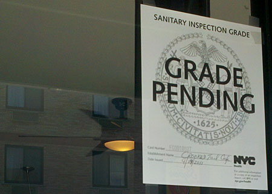

# Project 2: Shiny App Development Version 2.0

### [Project Description](doc/project2_desc.md)



In this second project of GR5243 Applied Data Science, we develop a version 2.0 of an *Exploratory Data Analysis and Visualization* shiny app about Restaurant Inspection scores in New York City using [NYC Open Data](https://data.cityofnewyork.us/Health/DOHMH-New-York-City-Restaurant-Inspection-Results/43nn-pn8j/data).

## Restaurant Inspection scores over time
Term: Fall 2019

+ Team #9
+ Team members: 
	+ Stefano Longo
	+ Yizhen Xu
	+ Xiyi Yan
	+ Haoyu Zhang

+ **Project summary**: The ability to analyse data in order to extract actionable intelligence is one of the main advantages of the current technological landscapes. Public bodies have access to untapped data resources and in fact, this project is mainly intentended for audiences like the NYC Health Department or any other entity interested in investigating restaurants' sanitary standards in New York City. 
Additionally, some information may even be helpful for consumers, such as NYC residents and/or tourists. The project is mainly divided in three key sections that focus on:
	+ the change over time of inspections and the associated results
	+ the change over time of the most frequent health violations
	+ the geographical distribution of inspections and the associated scores

+ **Contribution statement**: This project is the result of the effort of all the team members. Despite the difficult task of coordinating parts of the projects that are so interlinked to one another, we divided the assignemnt in order to maximise efficiency. Yizhen and Stefano worked mainly on selecting possible projects, cleaning the data and building the graphs. Xiyi and Haoyu were mainly responsible for developing the map and piecing all the components of the app together. Nonetheless, we supported each other across all stages of the project, answering each other's doubts both in person and online. At the beginning of the project, we did not share files on GitHub because a member of the team did not have access to it. All team members approve our work presented in this GitHub repository including this contributions statement. 

Following [suggestions](http://nicercode.github.io/blog/2013-04-05-projects/) by [RICH FITZJOHN](http://nicercode.github.io/about/#Team) (@richfitz). This folder is orgarnized as follows.

```
proj/
├── app/
├── lib/
├── data/
├── doc/
└── output/
```

Please see each subfolder for a README file.

